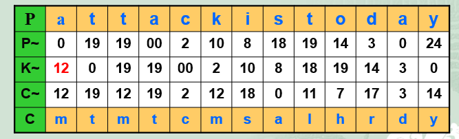
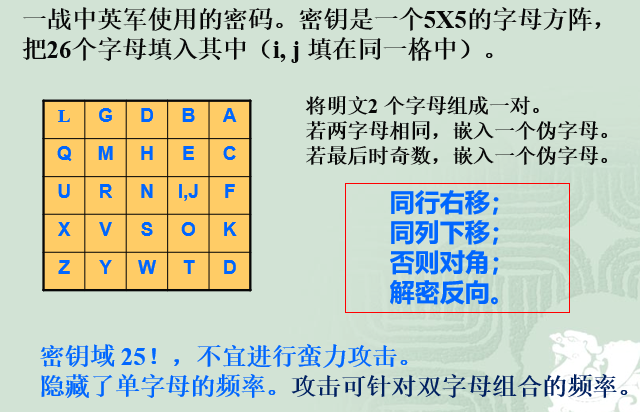
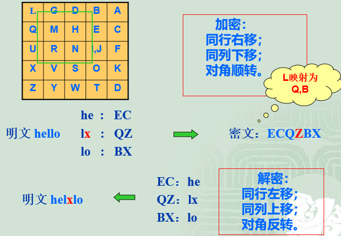
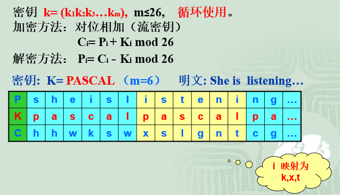
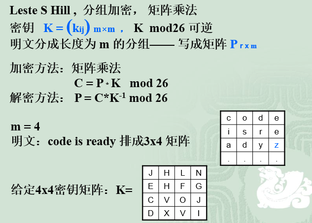
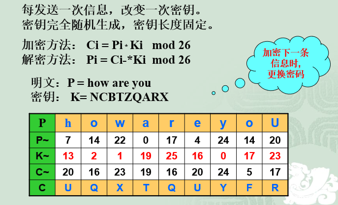
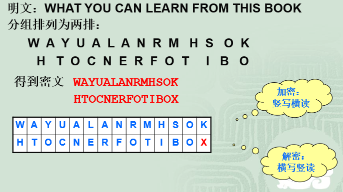
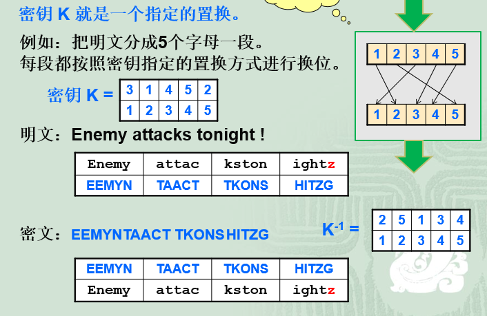
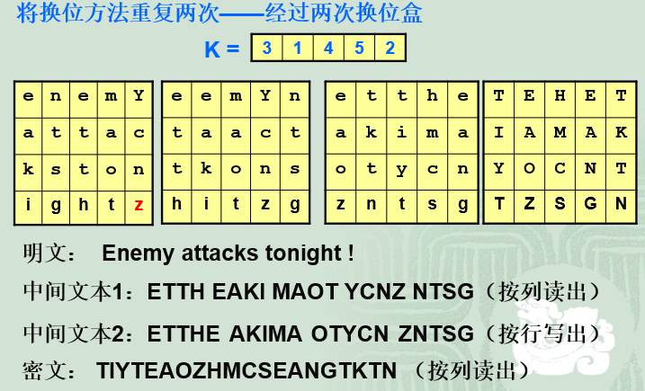
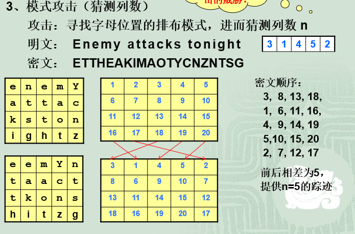

# 传统密码学

## 1 代换密码

### 1.1 单码代换

明文的字符与密文中的字符一一对应，总共有$26!$种不同的映射。

#### 1.1.1 凯撒（Caeser）密码

加密算法： $C=E(P)=P+3$
解密算法:  $P=D(C)=C-3

Key = 3

#### 1.1.2 加法密码（additive cipher) -- 移位密码

加密算法： $C=(P+k) mod 26 $
解密算法： $P=(C-k) mod 26 $

Key = k
密码域大小=26

#### 1.1.3 乘法密码 (multiplicative cipher)

加密算法： $C=(P \times k) mod 26$
解密算法： $P=(C \times k^{-1}) mod 26$

ps： **求逆用扩展欧几里得算法**

Key = k
密码域大小=12

#### 1.1.4 仿射密码(affine cipher)

加密算法：$C=(P\times k_1 + k_2) mod 26$
解密算法：$P=((C-k_2)\times k_1^{-1})mod26$

$Key=(k_1, k_2)$
密码域大下为12*26=312

#### 1.1.5 单表密码

利用密码本建立明文与密文之间的一一映射  

#### 1.1.6 代换密码小结

+ 单字母密码（简单替换技术）
+ 简单，便于记忆
+ 缺点：结构过于简单，密码分析员只使用很少的信息就可预言加密的整个结构
+ 致命弱点：不能抵抗频率统计攻击  

### 1.2 多码代换  

隐藏频率特征，可以防范频率统计攻击。

#### 1.2.1 自动密钥密码(Autokey Cipher) 

加密 $C_i = P_i + K_i mod 26$
解密 $P_i = C_i - K_i mod 26$

密码域26， 易受蛮力攻击

  

#### 1.2.2 PlayFair 密码

    

#### 1.2.3 Vigenere 密码  

  

#### 1.2.4 Hill密码(矩阵密码)  

  

#### 1.2.5 一次一密密码(One-time-pad - OTP)

  

## 2 换位密码(Transporsition Cipher)

换位密码是采用移动字母位置的方法进行加密的。

可能的攻击方法：
+ 单字母频率攻击  
+ 蛮力攻击：考虑所有可能的排列26！
+ 模式攻击

### 2.1 无密钥换位  

#### 2.1.1 栅栏密码(rail fence cipher)

  

#### 2.1.2 表格换位  

  

### 2.2 有密钥换位  

  

### 2.3 双换位与组合换位  

  

### 2.4 换位密码的分析 

+ 频率攻击
    + 特征: 保留单字频率，但不保留双字母、三字母频率  
    + 攻击： 判断是换位密码，然后单字母频率攻击  

+ 模式攻击：

  

## 3 密码机(Cipher Machine)  

